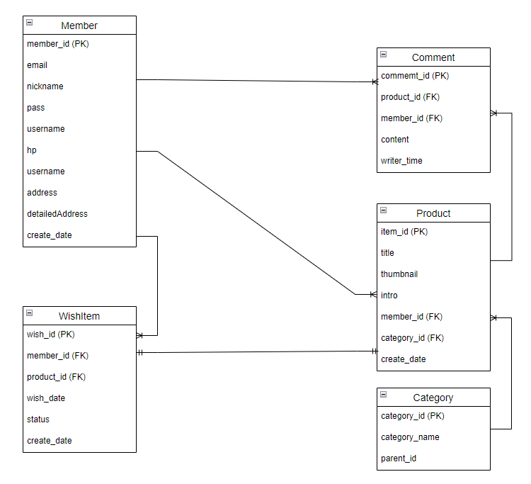
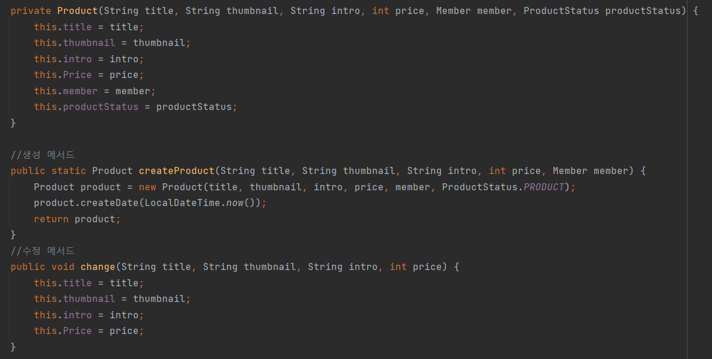
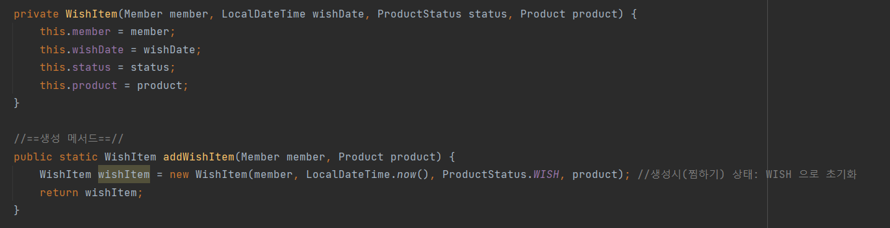
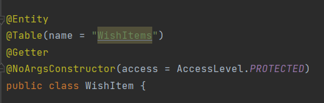

# :pushpin: MingMarket - 당신 근처의 밍마켓
>중고 거래부터 동네 정보까지, 이웃과 함께해요.

## 1. 제작 기간 & 참여 인원(역할)
- 2022년 5월 10일 ~ 진행중

## 2. 사용 기술
#### `Back-end`
1. Project:
    - Gradle Project
    - Language: Java 11
    - Spring Boot: 2.6.7
2. Dependencies
    - SpringWeb
    - Thymeleaf
    - Lombok
    - Validation
    - H2 Database
    - MySQL Driver
    - Spring Data JPA
    - Spring Security 2.4.5
#### `Front-end`
- JavaScript
- Thymeleaf
- HTML5


## 3. ERD 설계

## 4. 구현 요구사항

## 5. 핵심 기능 & 트러블 슈팅

### 1. JPA를 활용한 웹 애플리케이션 개발
<details>
<summary><b>기능 설명</b></summary>
<div markdown="1">
자바 진영의 ORM 기술 표준으로 사용되는 인터페이스의 모음인 JPA를 활용하여 웹 애플리 케이션을 개발하였다. <br>
JPA 인터페이스의 구현체로 Hibervate 프레임 워크를 사용하였다. <br>
이렇게 JPA를 사용함으로써 INSERT/UPDATE/SELECT 쿼리 등을 직접 작성하지 않아도 데이터를 저장할 수 있게 되었다.<br>
SQL 중심적인 개발이 아닌 Method를 통해서 DB를 조작할 수 있어, 개발자는 객체 모델을 이용해서 비즈니스 로직을 구성하는데만 집중할 수 있었다. <br>

특히 필드 변경이나 필드를 추가하게 될 경우 JPA가 자동으로 SQL을 처리해주기 때문에 유지보수가 수월하다. <br>
그리고 초반 개발단계에서는 H2 데이터베이스를 사용하였는데,
나중에 데이터베이스를 MySQL로 변경하여도 쿼리를 수정하지 않아도 된다는 장점이 있었다.  <br>
<br>

1. 도메인 모델 분석 (연관관계 매핑 분석)
   - **회원(Member)** 과 **상품(Product)**
   - 한명의 회원은 여러 상품을 등록할 수 있다.
   - 상품(Product)이 연관관계 주인으로 다대일 관계를 갖는다.
   - **회원(Member)** 과 **관심상품(WishItem)**
     - 한명의 회원은 여러개의 관심상품을 가질 수 있다.
     - 관심상품(WishItem)이 연관관계 주인으로 다대일 관계를 갖는다.
   - **관심상품(WishItem)** 과 **상품(Product)**
     - 관심상품은 단 하나의 상품에 해당된다.
     - 관심상품(WishItem)이 연관관계 주인으로 일대일 관계를 갖는다.
   - **상품(Product)** 과 **댓글(Comment)** 아직 구현 안함
     - 하나의 상품에는 여러 댓글을 달 수 있다.
     - 댓글(Comment)가 연관관계 주인으로 다대일 관계를 갖는다.
   - **회원(Member)** 과 **댓글(Comment)** 아직 구현 안함
     - 한명의 회원은 여러 댓글을 달 수 있다.
     - 댓글(Comment)가 연관관계 주인으로 다대일 관계를 갖는다.
   - **상품(Product)** 과 **카테고리(Category)** 아직 구현 안함
     - 하나의 상품은 여러개의 카테고리를 가질 수 있다.
2. 테이블 설계
   
3. 엔티티 개발
   <br>주요 사용한 어노테이션
   <br>@Entity: 
   <br>@Id: Primary Key를 지정
   <br>@GeneratedValue: 
   <br>@Embedded: 재사용이 가능함
   <br>@Embeddable: 
   <br>@ManyToOne(fetch = LAZY): 
   <br>@JoinColumn(name = "member_id"): 
   <br>@Enumerated(EnumType.STRING): Enum의 타입을 정함
   <br>
   <br>
   **※ 엔티티에서 Setter 사용 지양**
   <br> Setter는 호출시 데이터가 변동됩니다.
   <br> Setter를 열어두게 되면 프로젝트가 커지고 복잡해질수록 엔티티가 도대체 왜 어디서 변경되는지 추적하기 점점 힘들어집니다.
   <br> 그래서 엔티티의 데이터를 변경할 때는 아래 코드처럼 Setter 대신 변경지점이 명확하도록 변경을 위한 비즈니스 메서드를 따로 만들어 제공하였습니다.
   <br> 그리고 객체의 일관성을 유지하기 위해 객체 생성 시점에 값들을 넣어줌으로서 Setter 사용을 지양할 수 있었습니다.
   <br> 아래와 같이 기본 생성자 접근자를 protected로 변경하면 new Member() 사용을 막을 수 있어 객체의 일관성을 더 유지할 수 있습니다.
   <br><br>
   - Member Entity
   
   - Product Entity
   
   - WishItem Entity
   
   
   <br>아래와 같이 기본 생성자 접근자를 protected로 변경하면 new Entity() 사용을 막을 수 있어 객체의 일관성을 더 유지할 수 있습니다.
   <br>(protected로 설정하는 이유는 JPA 기본 스펙 상 기본 생성자가 필요한데 protected로 제어하는 것 까지 허용되기 때문입니다.)
   <br> 롬복을 사용하여 어노테이션 설정을 통해 간단하게 설정하였습니다.
   

</div>
</details>

<details>
<summary><b>트러블 슈팅</b></summary>
<div markdown="1">
<br>
<b>JPA - merge를 이용하여 값 수정시 수정하지 않는 데이터는 값이 null</b>
<br>

> 중고거래장터 밍마켓  
> 유저는 상품을 자유롭게 올릴 수 있다.  
> 올린 상품을 수정할 수 있다

Controller

```
    @PostMapping("/{productId}/edit")
    public String create(@PathVariable Long productId,@Valid @ModelAttribute("form") CreateProductForm form, BindingResult result,
                         @LoginCheck MemberDto.SessionMemberData loginMember,
                         RedirectAttributes redirectAttributes,
                         HttpServletRequest request
                         ) throws IOException {
        if (result.hasErrors()) { //만약에 result 안에 에러가 있으면
            return "product/createProductForm"; //다시 폼으로 이동
        }

        String realPath = request.getSession().getServletContext().getRealPath("/upload/");// 상대 경로
        String uploadFile = fileUpload.serverUploadFile(form.getThumbnail(), realPath);

        Product product = Product.updateProduct(form.getProductId, form.getTitle, form.getUploadFile, form.getIntro, form.getPrice);  
        // 저장
        productService.saveProduct(product);
        
        redirectAttributes.addAttribute("productId", productId);

        return "redirect:/product/detail/{productId}"; // 상품디테일 페이지로 넘어가게
    }
```

ProductRepository.java

```
@Repository
@RequiredArgsConstructor
public class ProductRepository {

    private final EntityManager em;

    // 상품 저장
    public void save(Product product) {
        if (product.getId() == null) { // 등록된 상품이 없을 경우 새로 등록
            em.persist(product);
        } else { // 상품이 존재할 경우 강제로 업데이트(즉, 수정)
            em.merge(product);
        }
    }
}
```

ProductDto.updateProductForm

```
@Getter
@Setter
public static class updateProductForm {
    
    private Long productId; //pk

    @NotBlank(message = "제목을 입력해주세요")
    private String title;

    private String uploadFileName;

    private MultipartFile uploadFile;

    @NotBlank(message = "상품 설명을 작성해주세요")
    private String intro;

    @NotNull(message = "상품 가격을 입력해주세요")
    @Range(min = 1000, max = 99999999, message = "1,000 ~ 99,999,999원으로 다시 입력해주세요")
    private int price;

    public updateProductForm(Long productId, String title, String thumbnail, String intro, int price) {
        this.productId = productId;
        this.title = title;
        this.uploadFileName = thumbnail;
        this.intro = intro;
        this.price = price;
    }
}
```

ProductEntity

```
@Entity
@Getter
@NoArgsConstructor(access = AccessLevel.PROTECTED)
public class Product extends BaseEntity { //상품

    @Id @GeneratedValue
    @Column(name = "product_id")
    private Long id; //pk

    private String title; //제목
    private String thumbnail; //섬네일
    private String intro; //설명(게시판)
    private int Price; //상품가격

    @ManyToOne(fetch = LAZY)
    @JoinColumn(name = "member_id")
    private Member member; //fk

    private Product(String title, String thumbnail, String intro, int price, Member member) {
        this.title = title;
        this.thumbnail = thumbnail;
        this.intro = intro;
        this.Price = price;
        this.member = member;
    }

    //생성 메서드
    public static Product createProduct(String title, String thumbnail, String intro, int price, Member member) {
        Product product = new Product(title, thumbnail, intro, price, member);
        product.createDate(LocalDateTime.now());
        return product;
    }
 }
```

결과:


수정시 MEMBER_ID가 계속 null값이 채워진다.

게시글 수정시 게시글 작성자(member_id)는 변경될 일이 없다.

그래서 아래 코드 실행시 member_id = null값이다.

```
 else { // 상품이 존재할 경우 강제로 업데이트(즉, 수정)
    em.merge(product);
}
```

> 병합은 준영속 상태의 엔티티를 다시 영속 상태로 변경할 때 사용한다.  
> merge() 메서드는 준영속 상태의 엔티티를 받아 그 정보로 새로운 영속 상태의 엔티티를 반환한다.

**merge()의 동작 방식**

1.  merge()를 실행
2.  파라미터로 넘어온 준영속 엔티티의 식별자 값으로 1차 캐시에서 엔티티를 조회
-   만약 1차 캐시에 엔티티가 없으면 데이터베이스에 엔티티를 조회하고 1차 캐시에 저장.
-   무조건 1번은 db 조회를 하므로 성능에 좋지 않을 수 있다.
3.  조회한 영속 엔티티에 product 엔티티의 값을 채워 넣음
-   이때 product 의 모든 값을 영속 엔티티에 채워 넣기 때문에 **null 값이 들어갈 수 도 있는 문제가 생긴다.**
-   이래서 업데이트 시 merge()보단 변경 감지를 사용하자.
4.  영속 상태의 객체를 반환

<br>

#### **수정된 코드**

**변경 감지 사용 (**dirtyChecking)****

Service

```
      /**
     * 상품 수정
     * JPA 변경 감지를 활용하여 update.
     * 트렌젝션이 종료될 때 변경된 부분에 대한 update query를 날린다.
     */
    @Transactional
    public void updateProduct(Long productId, ProductDto.updateProductForm form, String thumbnail) {
        Product findProduct = productRepository.findSingleProduct(productId);
        findProduct.change(form.getTitle(), thumbnail, findProduct.getIntro(), form.getPrice());

    }
```

Repository

```
public Product findSingleProduct(Long productId) {
    return em.find(Product.class, productId);
}
```

entityManager로 entity를 직접 꺼내, 값을 수정한다.

@Transactional으로 인하여 로직이 끝날 때 JPA에서 트랜잭션 commit 시점에 변경 감지(Dirty Checking)한 후 Flush를 한다.
<br>
<br>
<br>
<br>
<br>

</div>
</details>


### 2. 상품등록, 회원가입 그리고 로그인시 Validation 검증
<details>
<summary><b>기능 설명</b></summary>
<div markdown="1">

```
    /**
     * 중복 아이디 검증 메서드
     */
    private void validateDuplicateMember(Member member) {
        List<Member> findMembers = memberRepository.findByUserId(member.getUserId());
/*        if (!findMembers.isEmpty()) { //isEmpty(): 문자열 길이가 0일 경우 true 반환, 여기서는 !isEmpty: 값이 있다면
            throw new IllegalStateException("이미 존재하는 회원입니다.");
        }*/
        if (findMembers.size() > 0) { //이 코드가 더 최적화일 것 같다.
            throw new IllegalStateException("이미 존재하는 회원입니다.");
        }
    }
```
회원가입시 아이디 중복 검증 메서드

검증하고자 하는 객체(DTO) Annotation 사용함
Controller에서는 검증하고자 하는 객체(DTO) 앞에 @Valied 붙여서 검증함. 
그리고 BindingResult 객체는 검증 결과에 대한 결과 정보들을 담아서
```
        if (result.hasErrors()) { //만약에 result 안에 에러가 있으면
            return "product/createProductForm"; //다시 폼으로 이동
        }
```
(값이 있을 경우 = 검증 결과 오류를 내는 것들) 다시 폼으로 보내버림

그 외 객체에서 검증할 수 없는 것들은 

```
//로그인 실패시 (null)
if (loginMember == null) {
result.reject("loginFail", "아이디 또는 비밀번호가 일치하지 않습니다");
return "/members/login";
}
```

이런식으로 
그리고 view에서는 (타임리프)
````
                <div th:if="${#fields.hasGlobalErrors()}">
                    <p class="field-error" th:each="err : ${#fields.globalErrors()}"
                       th:text="${err}">전체 오류 메시지</p>
                </div>
````
글로벌 오류로 처리

<br>
검증과 오류 메시지 공식 메뉴얼 <br>
https://www.thymeleaf.org/doc/tutorials/3.0/thymeleafspring.html#validation-and-
error-messages

</div>
</details>

### 3. Spring Security 회원가입시 패스워드 암호화 적용하기
<details>
<summary><b>기능 설명</b></summary>
<div markdown="1">
[블로그 정리](https://intelliy-min.tistory.com/49)


</div>
</details>

### 4. 스프링이 제공하는 MultipartFile을 이용한 이미지 업로드
<details>
<summary><b>기능 설명</b></summary>
<div markdown="1">

내용

</div>
</details>


### 5. 서블릿 HTTP 세션을 활용한 로그인 상태 유지
<details>
<summary><b>기능 설명</b></summary>
<div markdown="1">

내용

</div>
</details>
<details>
<summary><b>트러블 슈팅</b></summary>
<div markdown="1">
<b>로그인 상태 유지시 경로 localhost:xxxx/; jsessionid=~~</b>
</div>
</details>


### 6. 스프링 인터셉터를 이용한 로그인 체크
<details>
<summary><b>기능 설명</b></summary>
<div markdown="1">

내용

</div>
</details>


<br>

## 6. 트러블 슈팅


<details>
<summary><b>로그인 : 없는 아이디 입력시 오류 처리(Optional 클래스 사용) - NoSuchElementException</b></summary>
<div markdown="1">
**현재 문제점**

1. 로그인시 잘못된 아이디(없는 아이디)를 입력하게 되면


2. **NoSuchElementException** 예외가 터져버린다.


에러메시지

java.util.NoSuchElementException: No value present at java.base/java.util.Optional.get(Optional.java:148) ~\[na:na\] at project.toyproject.service.LoginService.login(LoginService.java:31) ~\[classes/:na\] at

코드보기

MemberRepository

```
/**
 *로그인시 회원 조회
*TODO
*코드 리팩토링 예정(람다함수, stream사용해보기)
 */
public Optional<Member> findByloginId(String userId) {
    List<Member> members = em.createQuery("select m from Member m", Member.class)
            .getResultList();
    for (Member m : members) {
        if (m.getUserId().equals(userId)) { //값이 있을 경우
            return Optional.of(m);
        }
    }
    return Optional.empty(); //값이 없으면 null
}
```

LoginService

```
/**
 *로그인
*/
public Member login(String userId, String password) {
    Optional<Member> findMemberOptional = memberRepository.findByloginId(userId);

    //아이디 조회해서 해당 아이디 정보가 있을 경우( 없으면 null 반환받음)
    Member member = findMemberOptional.get();
    if (member.getPass().equals(password)) { //비밀번호가 (일치) 있을 경우
        return member;
    } else {
        return null; //비밀번호가 일치하지 않을 경우 null 반환
    }
}
```

LoginController

```
@PostMapping("/login")
public String login(@Valid @ModelAttribute("form") LoginDto form,
                    BindingResult result,
                    @RequestParam(defaultValue = "/") String redirectURL,
                    HttpServletRequest request) {
    if (result.hasErrors()) {
        return "/members/login";
    }

    Member loginMember = loginService.login(form.getUserId(), form.getPassword());


    //로그인 실패시 (null)
    if (loginMember == null) {
        result.reject("loginFail", "아이디 또는 비밀번호가 일치하지 않습니다");
        return "/members/login";
    }

    //로그인 성공처리
    Address address = loginMember.getAddress();
    MemberDto.SessionMemberData memberData = new MemberDto.SessionMemberData(
            loginMember.getId(), loginMember.getUserId(), loginMember.getNickname(), loginMember.getUsername());

    //기존 세션이 있으면 세션을 반환, 없으면 새로운 세션을 생성
    HttpSession session = request.getSession();
    //세션에 로그인 회원 정보를 보관 (쿠키에 key: JSESSIONID , value: UUID 로 들어감)
    session.setAttribute(LOGIN_MEMBER, memberData);

    return "redirect:" + redirectURL;
}
```

MemberService 코드를 다시 보자

```
/**
 *로그인
*/
public Member login(String userId, String password) {
    Optional<Member> findMemberOptional = memberRepository.findByloginId(userId);

    //아이디 조회해서 해당 아이디 정보가 있을 경우( 없으면 null 반환받음)
    Member member = findMemberOptional.get();
    if (member.getPass().equals(password)) { //비밀번호가 (일치) 있을 경우
        return member;
    } else {
        return null; //비밀번호가 일치하지 않을 경우 null 반환
    }
}
```

우선 findMemberOptional.get()으로 Optional 객체에 저장된 값에 접근한다.

여기서 저장된 값이 있다면 if문으로 넘어갈 것이다.

하지만 **Optional 객체에 저장된 값이 null이면 NoSuchElementException 예외가 발생한다.**

해당 아이디가 없을 경우 결국 if문이 실행되기 전에 예외가 터져버리는 것이다.

따라서 get()메소드를 호출하기 전에 Optional 객체에 저장된 값이 null인지 아닌지를 먼저 확인한 후 호출해야한다.

**문제해결**

| 메소드 | 설명 |
| --- | --- |
| static <T> Optional<T> empty() | 아무런 값도 가지지 않는 비어있는 Optional 객체를 반환함. |
| T get() | Optional 객체에 저장된 값을 반환함. |
| boolean isPresent() | 저장된 값이 존재하면 true를 반환하고, 값이 존재하지 않으면 false를 반환함. |
| static <T> Optional<T> of(T value) | null이 아닌 명시된 값을 가지는 Optional 객체를 반환함. |
| static <T> Optional<T> ofNullable(T value) | 명시된 값이 null이 아니면 명시된 값을 가지는 Optional 객체를 반환하며, 명시된 값이 null이면 비어있는 Optional 객체를 반환함. |
| T orElse(T other) | 저장된 값이 존재하면 그 값을 반환하고, 값이 존재하지 않으면 인수로 전달된 값을 반환함. |
| T orElseGet(Supplier<? extends T> other) | 저장된 값이 존재하면 그 값을 반환하고, 값이 존재하지 않으면 인수로 전달된 람다 표현식의 결괏값을 반환함. |
| <X extends Throwable> T   orElseThrow(Supplier<? extends X>  exceptionSupplier) | 저장된 값이 존재하면 그 값을 반환하고, 값이 존재하지 않으면 인수로 전달된 예외를 발생시킴. |

출처 - [코딩의 시작, TCP School](http://www.tcpschool.com/java/java_stream_optional)

**get() 메소드를 호출하기 전에**

**isPresent()를 사용하여 객체에 저장된 값이 null인지 아닌지를 확인할 것이다.**

LoginService

```
public Member login(String userId, String password) {
    Optional<Member> findMemberOptional = memberRepository.findByloginId(userId);

    //아이디 조회해서 해당 아이디 정보가 있을 경우( 없으면 null 반환받음)
    if (!findMemberOptional.isPresent()) {
        return null;
    }

    Member member = findMemberOptional.get();

    if (member.getPass().equals(password)) { //비밀번호가 (일치) 있을 경우
        return member;
    } else {
        return null; //비밀번호가 일치하지 않을 경우 null 반환
    }
}
```

**boolean isPresent(): 입력받은 아이디 정보가 존재하면 true, 존재하지 않을 경우 false 반환**

if문으로 아이디 정보가 없을 경우 null을 리턴한다.

다시 로그인을 시도해본다.


생각한 방향으로 잘 작동되는 것을 볼 수 있다.

> **Optional<T> 클래스**  
>  Integer, Double 클래스처럼 **'T' 타입의 객체를 포장해주는 래퍼 클래스**  
>  **모든 타입의 참조 변수를 저장할 수 있다.**  
>  이러한 Optional 객체를 사용하면 복잡한 조건문 없이 **null 값으로 인해 발생하는 예외를 처리할 수 있다.**  
>  다양한 예제는 아래 링크 참조

[코딩의 시작, TCP School](http://www.tcpschool.com/java/java_stream_optional)

</div>
</details>

### 해결하지 못한 문제

<details>
<summary><b>로그아웃시 메인("/")페이지로 이동되지 않음("/login?logout"으로 location되는 상황)</b></summary>
<div markdown="1">
내용
</div>
</details>


<br>

## 7. 코드 리팩토링

### 1. Controller에 노출되어 있는 Entity 객체 Service계층으로 옮기기
<details>
<summary><b>코드 설명</b></summary>
<div markdown="1">


</div>
</details>

## 8. 회고 / 느낀점

### 간단한 KPT
#### Keep

#### Problem

#### Try

